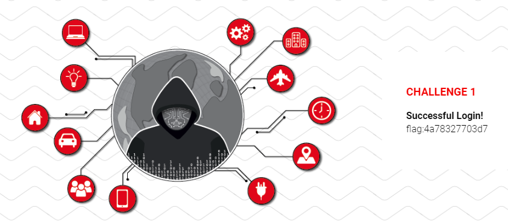
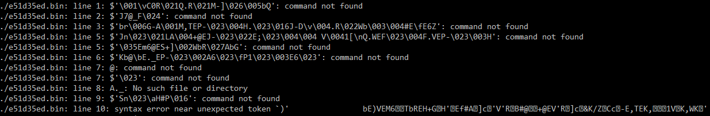
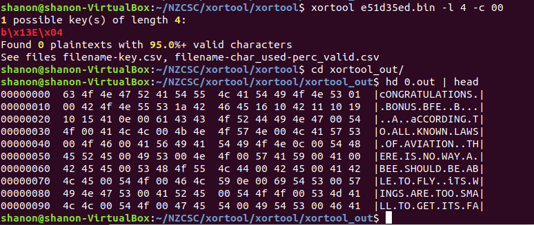
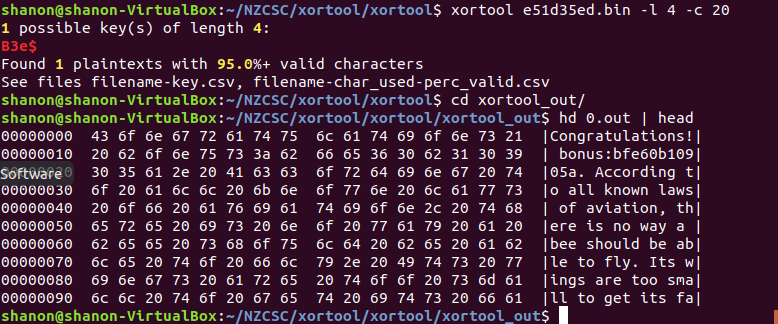

# New Zealand Cyber Security Challenge 2019 Qualifying Round

### Challenge 1

>Login to recieve the flag

Entering my challenge login details or anything else gives me an invalid username or password error so we will have a look at the pages source code instead.

```
<form onsubmit="login(event)">
	<label for="username">Username:</label>
	<input type="text" id="username" name="username" required><br>
	<label for="password">Password:</label>
	<input type="password" id="password" name="password" required><br>
	<input type="submit" name="submit" value="submit"><br>
	<label id="result" style="color:red;"></label>
</form>
```

We can see that the login box calls a login function so lets have a look at that.

```
function login(event) {
	document.getElementById('result').innerText = '';
	event.preventDefault();
	var username = document.getElementById('username').value;
	var password = document.getElementById('password').value;
	var xhr = new XMLHttpRequest();
	xhr.open('POST', './login.php');
	xhr.setRequestHeader('Content-type', 'application/x-www-form-urlencoded');
	xhr.onload = function () {
		// TODO: Switch to a better authentication method
		var text = this.responseText;
		if (text.toLowerCase() == 'yes') {
			window.location = './done.php';
		} else if (text.toLowerCase() == 'no') {
			document.getElementById('result').innerText = 'Invalid username or password';
		}
	};
	xhr.send(`username=${username}&password=${password}&submit=submit`);
}
```

From this we can see that a better authentication method is to be added, but thankfully for us it hasen't yet. The script shows that if the xhr request returns yes then the browser navigates to done.php. We can instead of entering the correct login details just insert this url instead.
This gives us the successful login page and the first flag.



## Challenge 2

>We are employing a simple XOR cipher to protect our communications. 
>To check that you have the correct key, please validate against the examples below.
>
> | Ciphertext in base64 | Plaintext |
> | --------------------- | ----------- |
> | bVQwJ2M3K0pCIjQm | Test message |
> | ekghNjF6HVxSNiEqLjcZcisyLzYrV1Ym | Cyber Security Challenge |
> | bVkmcyU2L14RKiBjMiddVSY9YzgrVV40 | The flag is hidden below |
> | X10iNHk5fQ4HIGBxPnwPU3c= | [REDACTED] |

This challenge tells us a XOR cipher is used and gives us some base64 encrypted examples. We can write a quick python script to decrypt the base64 and since we now have the XOR ciphertext and plaintext if we extend our script to XOR these two together we will get the key back.

```
The first ciphertext decodes to mT0'c7+JB"4&
When XORed with Test message we get
91CSCZN91CSC

The second decodes to mY&s%6/^* c2']U&=c8+U^4
When XORed with Cyber Security Challenge we get
91CSCZN91CSCZN91CSCZN91C

The third decoded is mY&s%6/^* c2']U&=c8+U^4
When Xored with The flag is hidden below we get
91CSCZN91CSCZN91CSCZN91C
```

In the decoded messages we can see the repeating pattern of 91CSCZN must be our key, and also NZCSC19 backwards. Once we XOR this key with the last ciphertext we get the next flag.

```
_]"4y9} `q>|Sw
91CSCZN91CSCZN91C
flag:c376c32d26b4
```

## Challenge 2 Bonus Flag

>The bonus flag was easily the hardest question for me and overall as it was only solved less than 10% of the participants.

When we inspect the pages source we see another base64 string comented out at the bottom of the page.

```
</body>

</html>
<!-- fnQXc211KwwAJ2B2PyoXUyo9 -->
```

XORing this with our key gives us GET ./e51d35ed.bin
Downloading this file gives us a 50Kb binary file which the linux file command tells us is an SVR2 pure executable (Amdahl-UTS) not stripped - version 609637140
I try using strings to look for flag and similar strings but don't get any showing up.

```
strings e51d35ed.bin | grep flag
```

I also try binwalk and don't find any hidden files in the bonus file and a hexdump doesn't show up anything immediatly apparent either.

Uploading to virustotal and a malware analysis site does not return any hits so lets try run the file in our sandbox.


 
Looks like it doesn't execute for us so I research a bit more about the file type. From what I can find is the SVR2 files were developed for the UNIX System V OS. SVR2 stands for System Five Release 2, apparently a common system running this version of UNIX was the PDP-11 and it's successor the VAX. I manage to find some emulators for these systems and try load the file but did not get any better output. Finally I try a disassembler for these two systems, no entry point can be found and once again don't get any answers from it.

Coming back to the challenge I decided since the main challenge 2 was using a XOR cipher perhaps the file is encrypted and the magic number at the start of the file is just a coincidence of this. Having a look at the hexdump again does look like it could be the result of XORed plaintext. Seeing this I XOR the entire file with our previous key 91CSCZN and once again get gibberish. File now reports only binary data and I don't find any strings in the file that could help us. Perhaps the file is XOR with a different key then? Doing some research I come across a XOR cracker called  [Xortool](https://www.aldeid.com/wiki/Xortool).

We run xortool and give it the original version of the file to analyse. It come back telling us that the most common key length is 4 followed closely by 12. Since the length of the flags in this competition are 12 characters lets go with with that. Now we have a good guess for the length of the key we just need to supply what we think is the most frequent byte in the file. I've gone with the suggested example of 00 which usually would be the most common byte in binaries.

```
./xortool.py test.txt.xor -l 12 -c 00
```



The tool manages to crack the key which it believes is b\ x13 E \x04 b\ x13 E \x04 b\ x13 E \x04. This is just b\ x13 E \x04 repeated 3 times so it looks like the key length was only 4 characters. It also reports 95%+ of the file decrypts to printable characters. Inspecting the outputted text it looks a little wierdly formatted, but we can clearly see cONGRATULATIONS and bONUS at the top of the file followed by large amount of text. Searching the file however I don't find our flag, since this is a bonus flag is should be prefixed with Bonus: like the bonus flag was in final challenge, however after bONUS in our decrypted file we just have gibberish before the main body of text starts. Inspecting the text I'm not really sure what we have so I google it and discover it's actually the entire Bee Movie script, [a popular meme from 2013 was posting the entire script](https://knowyourmeme.com/memes/bee-movie-script-according-to-all-known-laws-of-aviation).

I got back to the bytes immediatly following the word bonus and try XORing these with the original key again to no avail. Counting the bytes following bonus we have 15 before the movie script starts. 13 of these should be for the flag and the : following bonus and then 2 spaces I guess before the script. It looks like the key must be in these bytes. Having a look at the rest of the file again I notice that the text is all in uppercase except where captials should be, they are instead lowercase. Also the file has null characters \x00 instead of spaces. Remembering the way ascii is layed out I realise adding 0x20 to uppercase letters gives you the equivilant lowercase letter. I then take the 15 bytes following the word bonus and add 0x20 to each byte.

```
1a4246451610421110191015410e00
+ 0x20
3a6266653630623130393035612e20
In ascii we get :bfe60b10905a. 
```

Finally we have found the bonus key!

I decided to decode the original file again with xortool, this time I use a key length of 4 and give the most common byte as 0x20, the space character since we now know we have a movie script for the majority of the file. This time xortool tells us the key is B3e$ and that the decrypted file is 100% valid. Viewing the file now everything looks correct, the bonus key is fully visable and all capitilization and puncuation is correct.



I'm not sure if the key B3e$ was hidden somewhere else or we were just meant to crack it since it's only 4 character long, but I couldn't find any hints alluding to bees or anything similar elsewhere.

From the bonus challenge I learnt a lot about working with rare filetypes and how well xor cracking tools can work. If I had a similar challenge again I would know what tools to best use instead of trying to work with gibberish file just because the files signature looks correct.
