# New Zealand Cyber Security Challenge 2019 Qualifying Round

### Challenge 1

>Login to recieve the flag

Entering my challenge login details or anything else gives me an invalid username or password error so we will have a look at the pages source code instead.

```
<form onsubmit="login(event)">
	<label for="username">Username:</label>
	<input type="text" id="username" name="username" required><br>
	<label for="password">Password:</label>
	<input type="password" id="password" name="password" required><br>
	<input type="submit" name="submit" value="submit"><br>
	<label id="result" style="color:red;"></label>
</form>
```

We can see that the login box calls a login function so lets have a look at that.

```
function login(event) {
	document.getElementById('result').innerText = '';
	event.preventDefault();
	var username = document.getElementById('username').value;
	var password = document.getElementById('password').value;
	var xhr = new XMLHttpRequest();
	xhr.open('POST', './login.php');
	xhr.setRequestHeader('Content-type', 'application/x-www-form-urlencoded');
	xhr.onload = function () {
		// TODO: Switch to a better authentication method
		var text = this.responseText;
		if (text.toLowerCase() == 'yes') {
			window.location = './done.php';
		} else if (text.toLowerCase() == 'no') {
			document.getElementById('result').innerText = 'Invalid username or password';
		}
	};
	xhr.send(`username=${username}&password=${password}&submit=submit`);
}
```

From this we can see that a better authentication method is to be added, but thankfully for us it hasen't yet. The script shows that if the xhr request returns yes then the browser navigates to done.php. We can instead of entering the correct login details just insert this url instead.
This gives us the successful login page and the first flag.

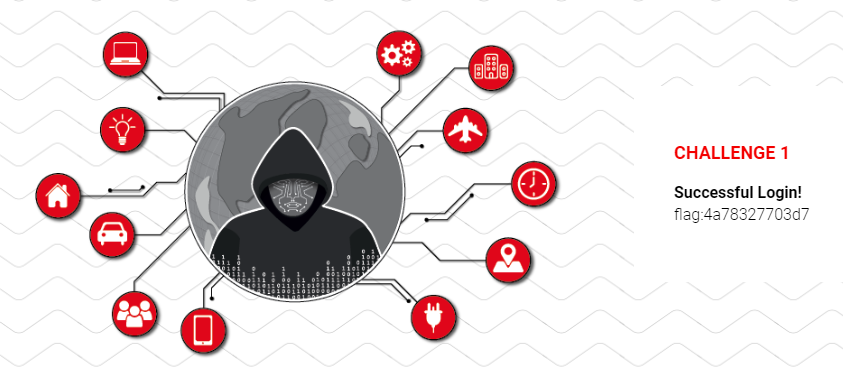

## Challenge 2

>We are employing a simple XOR cipher to protect our communications. 
>To check that you have the correct key, please validate against the examples below.
>
> | Ciphertext in base64 | Plaintext |
> | --------------------- | ----------- |
> | bVQwJ2M3K0pCIjQm | Test message |
> | ekghNjF6HVxSNiEqLjcZcisyLzYrV1Ym | Cyber Security Challenge |
> | bVkmcyU2L14RKiBjMiddVSY9YzgrVV40 | The flag is hidden below |
> | X10iNHk5fQ4HIGBxPnwPU3c= | [REDACTED] |

This challenge tells us a XOR cipher is used and gives us some base64 encrypted examples. We can write a quick python script to decrypt the base64 and since we now have the XOR ciphertext and plaintext if we extend our script to XOR these two together we will get the key back.

```
The first ciphertext decodes to mT0'c7+JB"4&
When XORed with Test message we get
91CSCZN91CSC

The second decodes to mY&s%6/^* c2']U&=c8+U^4
When XORed with Cyber Security Challenge we get
91CSCZN91CSCZN91CSCZN91C

The third decoded is mY&s%6/^* c2']U&=c8+U^4
When Xored with The flag is hidden below we get
91CSCZN91CSCZN91CSCZN91C
```

In the decoded messages we can see the repeating pattern of 91CSCZN must be our key, and also NZCSC19 backwards. Once we XOR this key with the last ciphertext we get the next flag.

```
_]"4y9} `q>|Sw
91CSCZN91CSCZN91C
flag:c376c32d26b4
```

## Challenge 2 Bonus Flag

>The bonus flag was easily the hardest question for me and overall as it was only solved less than 10% of the participants.

When we inspect the pages source we see another base64 string comented out at the bottom of the page.

```
</body>

</html>
<!-- fnQXc211KwwAJ2B2PyoXUyo9 -->
```

XORing this with our key gives me GET ./e51d35ed.bin
Downloading this file gives me a 50Kb binary file which the linux file command tells me is an SVR2 pure executable (Amdahl-UTS) not stripped - version 609637140
I try using `strings e51d35ed.bin | grep flag` to look for flag and similar strings but don't get any showing up. I also try `binwalk` and don't find any hidden files in the bonus file and a hexdump doesn't show up anything immediatly apparent either. Uploading to virustotal and a malware analysis site does not return any hits so I'll try to run the file in my sandbox.

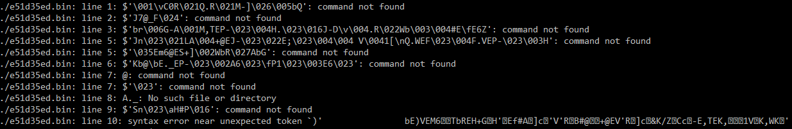
 
Looks like it doesn't execute for me so I research a bit more about the file type. From what I can find is the SVR2 files were developed for the UNIX System V OS. SVR2 stands for System Five Release 2, apparently a common system running this version of UNIX was the PDP-11 and it's successor the VAX. I manage to find some emulators for these systems and try load the file but did not get any better output. Finally I try a disassembler for these two systems, no entry point can be found and once again don't get any answers from it.

Coming back to the challenge I decided since the main challenge 2 was using a XOR cipher perhaps the file is encrypted and the magic number at the start of the file is just a coincidence of this. Having a look at the hexdump again does look like it could be the result of XORed plaintext. Seeing this I XOR the entire file with our previous key 91CSCZN and once again get gibberish. File now reports only binary data and I don't find any strings in the file that could help me. Perhaps the file is XOR with a different key then? Doing some research I come across a XOR cracker called  [Xortool](https://www.aldeid.com/wiki/Xortool).

We run xortool and give it the original version of the file to analyse. It come back telling me that the most common key length is 4 followed closely by 12. Since the length of the flags in this competition are 12 characters lets go with with that. Now we have a good guess for the length of the key we just need to supply what we think is the most frequent byte in the file. I've gone with the suggested example of 00 which usually would be the most common byte in binaries.

```
./xortool.py test.txt.xor -l 12 -c 00
```

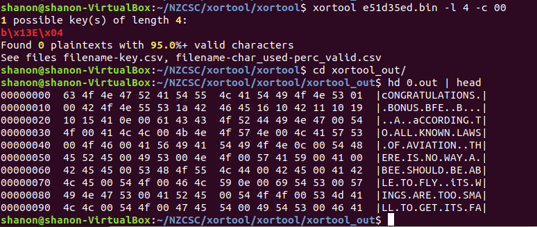

The tool manages to crack the key which it believes is b\ x13 E \x04 b\ x13 E \x04 b\ x13 E \x04. This is just b\ x13 E \x04 repeated 3 times so it looks like the key length was only 4 characters. It also reports 95%+ of the file decrypts to printable characters. Inspecting the outputted text it looks a little wierdly formatted, but we can clearly see cONGRATULATIONS and bONUS at the top of the file followed by large amount of text. Searching the file however I don't find our flag, since this is a bonus flag is should be prefixed with Bonus: like the bonus flag was in final challenge, however after bONUS in our decrypted file we just have gibberish before the main body of text starts. Inspecting the text I'm not really sure what we have so I google it and discover it's actually the entire Bee Movie script, [a popular meme from 2013 was posting the entire script](https://knowyourmeme.com/memes/bee-movie-script-according-to-all-known-laws-of-aviation).

I got back to the bytes immediatly following the word bonus and try XORing these with the original key again to no avail. Counting the bytes following bonus we have 15 before the movie script starts. 13 of these should be for the flag and the : following bonus and then 2 spaces I guess before the script. It looks like the key must be in these bytes. Having a look at the rest of the file again I notice that the text is all in uppercase except where captials should be, they are instead lowercase. Also the file has null characters \x00 instead of spaces. Remembering the way ascii is layed out I realise adding 0x20 to uppercase letters gives you the equivilant lowercase letter. I then take the 15 bytes following the word bonus and add 0x20 to each byte.

```
1a4246451610421110191015410e00
+ 0x20
3a6266653630623130393035612e20
In ascii we get :bfe60b10905a. 
```

Finally we have found the bonus key!

I decided to decode the original file again with xortool, this time I use a key length of 4 and give the most common byte as 0x20, the space character since we now know we have a movie script for the majority of the file. This time xortool tells us the key is B3e$ and that the decrypted file is 100% valid. Viewing the file now everything looks correct, the bonus key is fully visable and all capitilization and puncuation is correct.

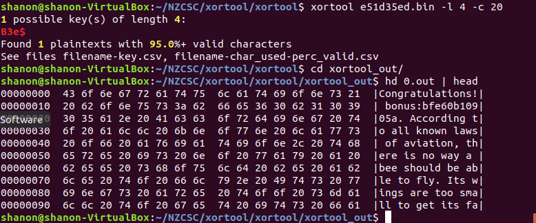

I'm not sure if the key B3e$ was hidden somewhere else or we were just meant to crack it since it's only 4 character long, but I couldn't find any hints alluding to bees or anything similar elsewhere.

From the bonus challenge I learnt a lot about working with rare filetypes and how well xor cracking tools can work. If I had a similar challenge again I would know what tools to best use instead of trying to work with gibberish file just because the files signature looks correct.

## Challenge 3

>Welcome to the IOT Web Terminal! Due to the limitations of the device, only a few commands can be run and only a single argument can be entered for each command.
>Feel free to poke around!

A single input box is given to execute commands from. Checking the pages source I can see it is a small php script to validate the input. I can also see that there is a regex that checks for ls, file, cat, head, tail. There is also a help command but that just gives us the list of commands just discovered. I have a look what files are available with `ls`. We get back 6 files

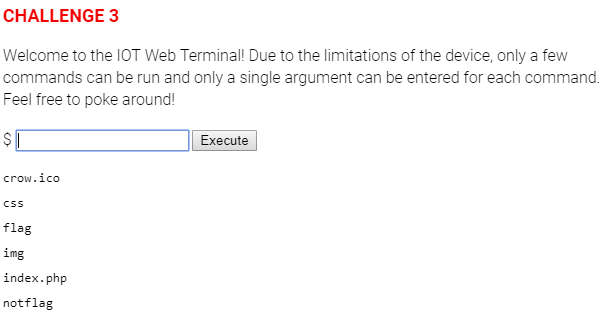

There is a file called flag so I have a look at that with `cat flag` and get

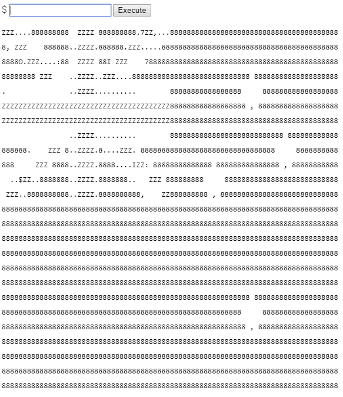

Well I guess it is a flag, but not the one we are looking for. notflag is also as it says, not the flag. The other files are just the files for the actual webpage we are doing the challenge on and don't seem to be of much more use. The file command also does not seem to work at all and head and tail are not much use over cat since we can only use one argument. I quickly think of something else to try, using `ls -a` which will display all files including hidden files (files starting with a .). I use `ls -al` to get a list of all files and the l option to provide more details about each file.

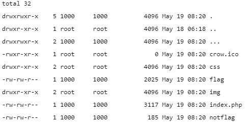

We get a few more files now, . is just the current directory and .. is the parent directory. Usually you would use cd .. to change directory to the parent directory. But there is also a ... file too which is actually another directory. Since we don't have a cd command available we can use `ls ...` to show us what is in that directory. It reveals a flag file, all we have to do now is use `cat .../flag` to see whats in the file and get the next flag.

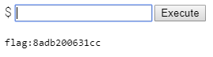

## Challenge 4

>We are given an image of our next flag except it has been hidden with a black brush.

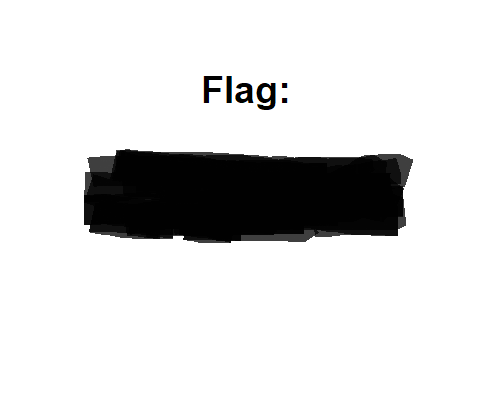

Downloading the image and having a look at it with `file` does not reveal anything unexpected. Using `binwalk` to check for hidden files also does not give us any answers. I then decided to check the exif data in the image and this is what I get.

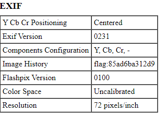

In the image history is the next flag.

## Challenge 4 Bonus Flag

>The bonus flag once again proves to be a greater challenge than the original flag was.

I didn't find anything else hidden in the original flag file so I have a look at the pages source. Initially I didn't find anything that stands out but after looking at the address for the favicon I notice that it is `.crow.ico` when on all the other pages it is only `crow.ico`. I download both files and immediatly notice that the .crow.ico file is a about 1KB larger than the normal one, this must be where the bonus flag is hidden. Binwalk shows us a PNG file and a Zlib compressed data file, Using `binwalk -e flag.ico` to extract the hidden files I get given the Zlib compressed file only. Decompressing this file just gives me a unknown file which is just reported as data by the file command, I can't seem to find anything else in this file.

I then decided to compare the normal favicon and the larged one side by side with a hexdump. I notice where the files start to differ and find at address `0x25DE` there is data which is not in the original file at all. There is 1006 bytes of extra data before files match up again. I look up how to extract parts of a file and find using the `dd` command will be best to do it. Using `dd skip=9694 count=1008 if=crow.ico of=out bs=1` I manage to extract the hidden file, I had to use a block size of 1 or else dd was unable to skip to the correct offset. Checking the extracted file tells us that it is a greyscale PNG file, opening it gives us the bonus flag.


I'm curious why binwalk didn't originally extract the file and only gave me the compressed file so I research a bit more. I find that using binwalk with the `-e` option to extract hidden files only extracts certain filetypes and I have to manually tell it to extract a png file. Using `binwalk --dd='png' crow.ico` I get binwalk to extract the image and give us the bonus flag. I missed this the first time I used binwalk as I was presuming the PNG file that it showed was the original favicon image since it didn't extract it by default. Next time I will know to tell binwalk to extract all files and that just using the `-e` option does not do that.

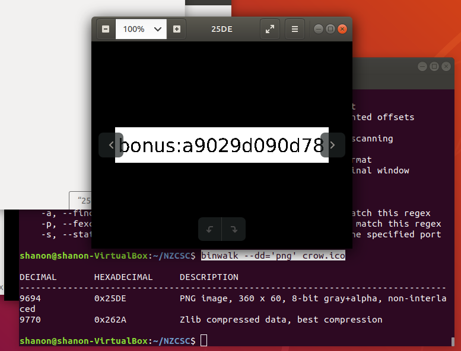

## Challenge 5

>You don't know who stole your flag, but you have a list of suspects. First guy on the list is Fitzgerald Kemp.
>Search for a name:

We are given a search box where we can lookup a user and are given their age, country and PID. Searching for the given name `Fitzgerald Kemp` we are given their details. The details given to us don't seem to be much use, but this does look like its just a database lookup so perhaps we can use some SQL Injection to dump the whole database. SQLi works and using `' OR '1'='1` and clicking search returns the whole database to us.

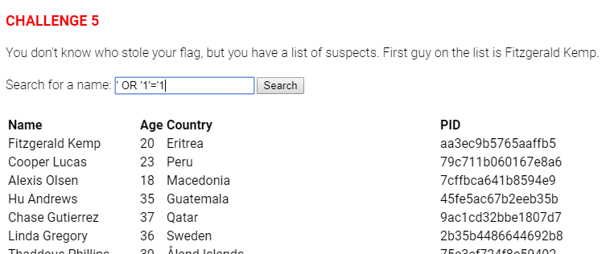

There is a lot of entries returned so I just use my browsers find capability to search for the string flag and we find it down in a user called Chancellor Fry's PID.

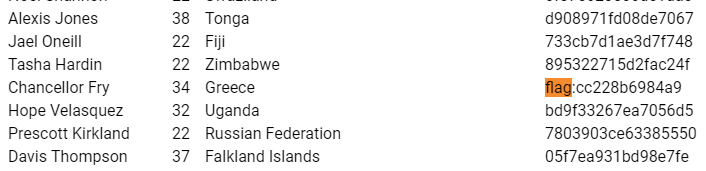

## Challenge 6

>For this challenge we are given a virtual machine image to use.

Opening the image with VirtualBox the name of the systems is `NZCSC R0C6 TCL`. When the image is run I find out that it is a tiny core linux distribution with only the CLI included. Checking the files on the sysems with `ls` we are only shown 1 file `validate`. Running this file asks to enter a flag for validation. I have no idea what the flag is so I enter some random text and after validating for a few seconds the program returns failed!

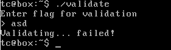

I try run binwalk, but it is not included in the provided system and we are unable to install new packages either. I decide to check what strings there are in the program. I get a large list so I pipe the output to grep so it can look for the flag `strings validate | grep flag`. I get a list of about 80 different flags so I redirect the output from grep to a file `strings validate | grep flag > flags.txt`. I then remove any text that is not in our correct flag format so we are only left with a text file of 12 character flags. Once this is done I write a quick script to go through the file line by line and redirect the output as input to the validate program. After a few minutes all the keys have been tried and none of them were correct so I'll need to take a different approach.

Next I check if the system has a debugger available and I find GDB is there. I open validate with gdb and check what variables are defined. GDB reports that the program has 12 defined variables, 10 of which are string arrays and one is an array of flags. Viewing the variables I get a list of the strings I saw when I ran the program but I notice a few new strings including one that it a GET request to challenge server. 

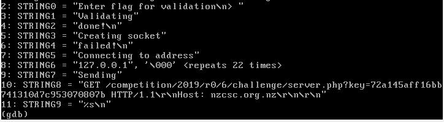

I enter the URL into a browser `https://nzcsc.org.nz/competition/2019/R0/6/challenge/server.php?key=72a145aff16bb741310d7c953070807b` and when the page loads it gives us the bonus flag `bonus:b55d54a59457`. Looks like I stumbled across the bonus key before I found the main key for the challenge. I decide to try running the validate program and giving it this bonus key, however that still gives me the failed output. I decide the best option is to check what functions the program runs and set a breakpoint at each one to see what local variables are set. The program has 6 functions named `FUNC0` to `FUNC5`. I notice that FUNC4 is the only one that accepts any paramaters and returns a value, it actually accepts a character array and returns an int so I guess this might be the function that compares the key we give the program.

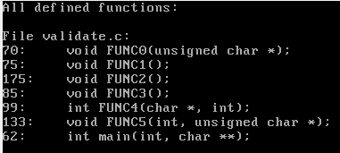

Setting a breakpoint at FUNC4 does not seem to help so I decided to step through the program and when it jumps into FUNC2 we get some local variables, one is called flag and has the data `flag = 0x804c400 <flags+576> "flag:51bd3c2fdb67"`. 

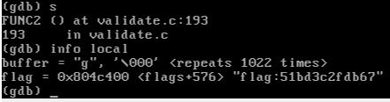

This looks like its our key, I enter it and it is accepted. I decide to run the validate program with the correct flag to see what happens this time. Initally it doesn't work, then I try prefix it with flag: and we are able to validate the flag correctly.

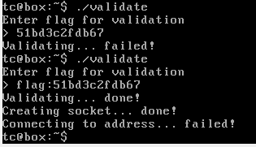

 However the program tries to connect to an address and fails, I'm not really sure what it is meant to do but it doesn't matter since we now have the flag and the bonus flag anyway. I guess my script that checked every flag we found earlier wouldn't have worked then since I removed the flag: prefixs. I'm still curious if the flag was in our original list that we extracted from the program so I go back and check again but don't find it. I then check the flags array with gdb and find it is in there, just the flag is written backwards so thats why it didn't show up when we searched the programs strings for flag. I then search the strings again, this time for galf and sure enough our flag is there in reverse. Next time I'll remember to search to both flag and galf.